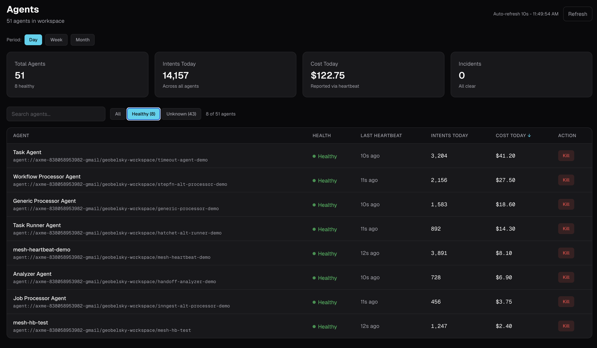

# AI Agent Health Monitoring

3 of your 20 agents crashed and you found out from customers. AXME monitors agent health with automatic heartbeat checks - every agent reports in, and you know the moment one goes silent.

AI agents run as background processes across multiple machines. They crash. They hang. They run out of memory. Without health monitoring, a crashed agent looks identical to a working agent - until someone notices the output stopped.

> **Alpha** - Built with [AXME](https://github.com/AxmeAI/axme) (AXP Intent Protocol).
> [cloud.axme.ai](https://cloud.axme.ai) - [hello@axme.ai](mailto:hello@axme.ai)

---

## The Problem

```
Your fleet: 20 agents across 4 machines.

Monday 09:00 - All agents running
Monday 14:30 - order-processor agent OOM killed on machine-3
Monday 14:30 - No alert. No log. Process just gone.
Monday 14:30 - refund-agent on machine-3 hangs (downstream dep was order-processor)
Monday 15:00 - Still no alert.
Monday 17:45 - Customer: "My refund has been pending for 3 hours"
Monday 17:50 - Engineer SSHs into machine-3. "Oh. It's been dead since 2:30."

What should have happened:
Monday 14:30 - order-processor misses heartbeat
Monday 14:31 - Status: HEALTHY -> UNREACHABLE
Monday 14:31 - Alert fires: "order-processor on machine-3 unreachable"
Monday 14:32 - Engineer checks dashboard, sees the dead agent
Monday 14:35 - Restart. Back online. Customers never notice.
```

---

## The Solution

```python
from axme import AxmeClient, AxmeClientConfig
import os

client = AxmeClient(AxmeClientConfig(api_key=os.environ["AXME_API_KEY"]))

# Start heartbeat - agent reports health every 30 seconds
client.mesh.start_heartbeat(interval_seconds=30)

# Your agent does its work. Heartbeat runs in background.
while True:
    task = get_next_task()
    result = process(task)
    client.mesh.report_status("healthy", metadata={"tasks_processed": count})
```

From any other service or dashboard:

```python
# See all agents and their health
agents = client.mesh.list_agents()
for agent in agents:
    print(f"{agent.name}: {agent.status} (last seen: {agent.last_heartbeat})")
```

```
order-processor:    HEALTHY      (last seen: 2s ago)
refund-agent:       HEALTHY      (last seen: 5s ago)
inventory-sync:     DEGRADED     (last seen: 28s ago, high latency)
email-sender:       UNREACHABLE  (last seen: 3m ago)
```

---

## Quick Start

```bash
pip install axme
export AXME_API_KEY="your-key"   # Get one: axme login
```

### Agent Side (reports health)

```python
from axme import AxmeClient, AxmeClientConfig
import os

client = AxmeClient(AxmeClientConfig(api_key=os.environ["AXME_API_KEY"]))

# Register this agent in the mesh
client.mesh.register(
    agent_uri="agent://myorg/production/order-processor",
    metadata={"machine": "machine-3", "version": "1.4.2"},
)

# Start automatic heartbeat (background thread, every 30s)
client.mesh.start_heartbeat(interval_seconds=30)

# Agent does its normal work
def run():
    while True:
        task = get_next_task()
        try:
            result = process(task)
            client.mesh.report_status("healthy", metadata={
                "last_task": task.id,
                "queue_depth": get_queue_depth(),
            })
        except Exception as e:
            client.mesh.report_status("degraded", metadata={
                "error": str(e),
                "last_task": task.id,
            })

run()
```

### Monitor Side (checks health)

```python
from axme import AxmeClient, AxmeClientConfig
import os

client = AxmeClient(AxmeClientConfig(api_key=os.environ["AXME_API_KEY"]))

# List all agents and their current status
agents = client.mesh.list_agents()
for agent in agents:
    print(f"{agent.name}: {agent.status}")
    print(f"  Last heartbeat: {agent.last_heartbeat}")
    print(f"  Machine: {agent.metadata.get('machine', 'unknown')}")
    if agent.status != "healthy":
        print(f"  ALERT: {agent.name} is {agent.status}")
```

---

## Health Statuses

| Status | Meaning | Trigger |
|---|---|---|
| `HEALTHY` | Agent is running and reporting normally | Heartbeat received within expected interval |
| `DEGRADED` | Agent is running but reporting problems | Agent calls `report_status("degraded")` |
| `UNREACHABLE` | Agent stopped sending heartbeats | No heartbeat for 2x the interval |
| `KILLED` | Agent was intentionally terminated | Explicit kill command or shutdown signal |

---

## Before / After

### Before: DIY Health Monitoring

```python
# health_checker.py - separate process you build and maintain
import redis
import time
import requests

r = redis.Redis()

def health_check_loop():
    while True:
        agents = r.smembers("registered_agents")
        for agent_id in agents:
            last_ping = r.get(f"heartbeat:{agent_id}")
            if last_ping is None:
                send_slack_alert(f"Agent {agent_id} never registered")
                continue
            elapsed = time.time() - float(last_ping)
            if elapsed > 90:
                send_pagerduty_alert(f"Agent {agent_id} unreachable for {elapsed}s")
                r.hset(f"agent_status:{agent_id}", "status", "unreachable")
            elif elapsed > 60:
                send_slack_alert(f"Agent {agent_id} degraded")
                r.hset(f"agent_status:{agent_id}", "status", "degraded")
        time.sleep(30)

# heartbeat_sender.py - added to every agent
def send_heartbeat():
    while True:
        r.set(f"heartbeat:{AGENT_ID}", time.time())
        time.sleep(30)

# Plus: Redis infrastructure, Slack webhook code, PagerDuty integration,
# status dashboard, agent registration endpoint, cleanup for dead agents...
```

### After: AXME Mesh Health (built-in)

```python
client.mesh.start_heartbeat(interval_seconds=30)
# Done. Platform handles detection, alerting, dashboard.
```

---

## Dashboard



View agent health at [mesh.axme.ai](https://mesh.axme.ai).

---

## How It Works

```
+-----------+  register()     +----------------+  store   +-----------+
|           | --------------> |                | -------> |           |
|   Agent   |  heartbeat()    |   AXME Cloud   |          | PostgreSQL|
|           | -- every 30s -> |   (platform)   | <------- |           |
|           |  report_status  |                |  query   +-----------+
+-----------+                 |                |
                              |  missed beat?  |          +-----------+
                              |  v             | alert -> |           |
                              |  UNREACHABLE   |          |  On-Call  |
                              |                |          |  Engineer |
+-----------+  list_agents()  |                |          +-----------+
|           | <-------------- |                |
| Dashboard |                 +----------------+
|           |
+-----------+
```

---

## Run the Full Example

### Prerequisites

```bash
curl -fsSL https://raw.githubusercontent.com/AxmeAI/axme-cli/main/install.sh | sh
axme login
pip install axme
```

### Terminal 1 - Start Monitored Agent

```bash
export AXME_API_KEY="your-key"
python agent.py
```

### Terminal 2 - Check Health

```bash
python monitor.py
# Output:
# order-processor: HEALTHY (last seen: 2s ago)
```

### Terminal 1 - Kill the Agent

```bash
# Ctrl+C or kill the process
```

### Terminal 2 - Observe Status Change

```bash
python monitor.py
# Output:
# order-processor: UNREACHABLE (last seen: 65s ago)
# ALERT: order-processor missed 2 heartbeats
```

---

## Related

- [AXME](https://github.com/AxmeAI/axme) - project overview
- [Agent Timeout and Escalation](https://github.com/AxmeAI/agent-timeout-and-escalation) - timeout with automatic escalation
- [AI Agent Checkpoint and Resume](https://github.com/AxmeAI/ai-agent-checkpoint-and-resume) - crash recovery
- [AXME Mesh Dashboard](https://github.com/AxmeAI/axme-mesh-dashboard) - real-time agent fleet dashboard
- [AXME Examples](https://github.com/AxmeAI/axme-examples) - 20+ runnable examples

---

## License

MIT - see [LICENSE](LICENSE).

---

Built with [AXME](https://github.com/AxmeAI/axme) (AXP Intent Protocol).
